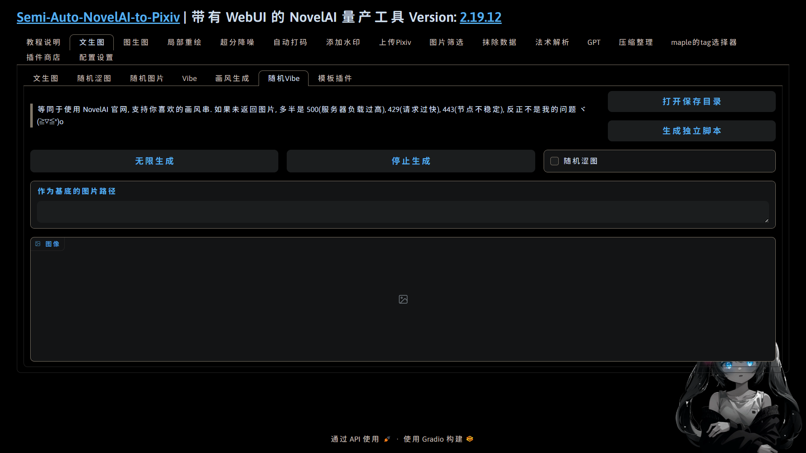

  </a>

<h1 align="center">sanp_plugin_random_vibe</h1>
<h4 align="center">✨还原旧版 vibe 随机出图的功能✨</h4>

    
    
    
    
    

## 💬 介绍

还原旧版 vibe 随机出图的功能

## ✨ 功能

## 💿 安装

- 方法1. 在插件商店粘贴本插件名字(sanp_plugin_random_vibe)并点击安装

- 方法2. 在[主体项目](https://github.com/zhulinyv/Semi-Auto-NovelAI-to-Pixiv) `plugins\t2i` 目录下直接克隆本项目

## 🔧 配置

你可以参考配置设置里的其它, 修改 `favorite.json` 文件来自定义想要抽取的内容
